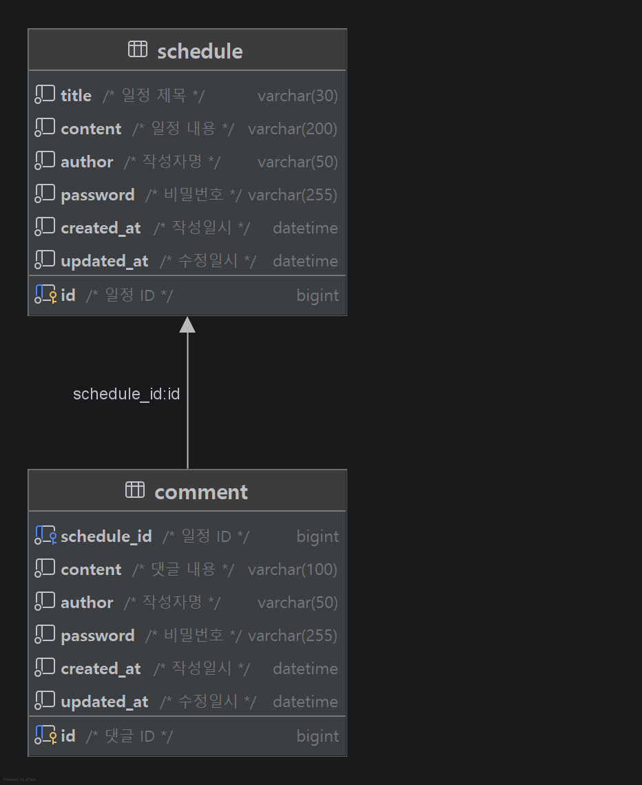

## 📅 일정 관리 시스템 (Schedule Management System)

이 프로젝트는 일정을 관리하고, 각 일정에 댓글을 달 수 있는 백엔드 API 서버입니다.

### 📁 디렉토리 구조
```text
src/main/java/com/example/schedulemanagement
├── ScheduleManagementApplication.java
├── controller
│   └── ScheduleController.java
├── dto
│   ├── request
│   │   ├── CommentRequestDto.java
│   │   └── ScheduleRequestDto.java
│   └── response
│       ├── CommentResponseDto.java
│       ├── ScheduleResponseDto.java
│       └── ScheduleWithCommentResponseDto.java
├── entity
│   ├── Comment.java
│   └── Schedule.java
├── repository
│   ├── CommentRepository.java
│   └── ScheduleRepository.java
└── service
    ├── CommentService.java
    └── ScheduleService.java
```
---
### 🖥️ Controller (API 계층)
ScheduleController: 일정과 댓글에 관련된 모든 API 엔드포인트를 관리
- "/schedules"를 기본 경로로 사용하며, 클라이언트의 요청을 받아 서비스 계층으로 전달하고 응답을 반환

### 📦 DTO (Data Transfer Object)
- RequestDto  : 클라이언트로부터 전달받는 데이터의 유효성을 검증(validate())하고, 이를 엔티티로 변환(toEntity())하는 역할을 수행
- ResponseDto : 엔티티를 클라이언트에게 노출하기 적합한 형태로 포장합니다. 비밀번호와 같은 민감 정보는 제거하고, API 요구사항에 맞는 구조로 데이터를 담아 반환

### 💾 Entity (도메인 모델)
Schedule / Comment: 데이터베이스 테이블과 매핑되는 핵심 객체
- 빌더 패턴을 사용하여 객체 생성을 안전하게 관리하며, JPA Auditing을 통해 작성일(createdAt)과 수정일(updatedAt)을 자동으로 처리합니다.

### 🔍 Repository (데이터 접근 계층)
ScheduleRepository / CommentRepository: JpaRepository를 상속받아 DB 연동을 담당
- 기본 CRUD 외에도 정렬(OrderByUpdatedAtDesc) 및 조건부 조회, 개수 제한(countByScheduleId)을 위한 커스텀 쿼리 메서드가 정의되어 있습니다.

### ⚙️ Service (비즈니스 로직 계층)
ScheduleService / CommentService: 시스템의 핵심 비즈니스 로직 구현
- 입력값 유효성 검사(validate)
- 데이터 존재 여부 확인
- 제약 조건(댓글 10개 제한 등) 및 비즈니스 규칙 적용
- 트랜잭션 관리(@Transactional)

---
### 🛠 주요 기술 스택

| 구분 | 기술                 |
| :--- |:-------------------|
| **Language** | Java 17            |
| **Framework** | Spring Boot 4.1.0  |
| **ORM** | Spring Data JPA    |
| **Database** | MySQL              |
| **Library** | Lombok, Spring Web |
---

### 📝API 명세서

1. 일정 조회 (전체)
- **Method**: `GET`
- **URI**: `/schedules`
- **비고**: `?author={작성자명}` 쿼리 파라미터로 조건 검색
- **Response**: `200 OK`
```JSON
[
  {
    "author": "홍길동",
    "content": "일정 내용입니다.",
    "createdAt": "2026-06-29T19:43:05",
    "id": 6,
    "title": "첫 번째 일정 제목",
    "updatedAt": "2026-06-29T19:43:05"
  },
  {
    "author": "수정된 작성자",
    "content": "JPA Entity 매핑 및 연관관계 복습하기",
    "createdAt": "2026-06-27T19:50:16",
    "id": 1,
    "title": "수정된 제목",
    "updatedAt": "2026-06-29T19:42:56"
  },
  {
    "author": "홍길동",
    "content": "일정 내용입니다.",
    "createdAt": "2026-06-29T19:38:10",
    "id": 5,
    "title": "첫 번째 일정 제목",
    "updatedAt": "2026-06-29T19:38:10"
  },
  {
    "author": "김철수",
    "content": "ERD 다이어그램 수정 및 테이블 구조 확정",
    "createdAt": "2026-06-27T19:50:16",
    "id": 2,
    "title": "DB 설계 회의",
    "updatedAt": "2026-06-27T19:50:16"
  },
  {
    "author": "이영희",
    "content": "RESTful API 엔드포인트 및 DTO 정리",
    "createdAt": "2026-06-27T19:50:16",
    "id": 3,
    "title": "API 명세서 작성",
    "updatedAt": "2026-06-27T19:50:16"
  },
  {
    "author": "박민수",
    "content": "과제 최종 테스트 및 코드 리팩토링 진행",
    "createdAt": "2026-06-27T19:50:16",
    "id": 4,
    "title": "백엔드 프로젝트",
    "updatedAt": "2026-06-27T19:50:16"
  }
]
```

2. 일정 조회 (단건)
- **Method**: `GET`
- **URI**: `/schedules/{id}`
- **비고**: 해당 일정의 댓글 목록 포함
- **Response**: `200 OK`
```JSON
{
  "id": 1,
  "title": "일정 제목",
  "content": "일정 내용",
  "author": "작성자명",
  "createdAt": "2026-06-29T19:43:05",
  "updatedAt": "2026-06-29T19:43:05",
  "comments": [
    {
      "id": 1,
      "content": "댓글 내용",
      "author": "댓글작성자",
      "createdAt": "2026-06-29T19:45:00",
      "updatedAt": "2026-06-29T19:45:00"
    }
  ]
}
```

3. 일정 생성
- **Method**: `POST`
- **URI**: `/schedules`
- **비고**: 제목(최대 30자), 내용(최대 200자), 작성자명, 비밀번호 필수 입력
- **Request**:
```JSON
{
  "title": "일정 제목",
  "content": "일정 내용",
  "author": "작성자명",
  "password": "비밀번호"
}
```
- **Response**: `201 Created`
```JSON
{
  "id": 1,
  "title": "일정 제목",
  "content": "일정 내용",
  "author": "작성자명",
  "createdAt": "2026-06-29T19:43:05",
  "updatedAt": "2026-06-29T19:43:05"
}
```

4. 일정 수정
- **Method**: `PATCH`
- **URI**: `/schedules/{id}`
- **비고**: 제목(최대 30자), 작성자명만 수정 가능 (비밀번호 확인 필수)
- **Request**:
```JSON
{
  "title": "새로운 제목",
  "author": "새로운 작성자",
  "password": "비밀번호"
}
```
- **Response**: `200 OK`
```JSON
{
  "id": 1,
  "title": "새로운 제목",
  "content": "일정 내용",
  "author": "새로운 작성자",
  "createdAt": "2026-06-29T19:43:05",
  "updatedAt": "2026-06-29T19:45:10"
}
```

5. 일정 삭제
- **Method**: `DELETE`
- **URI**: `/schedules/{id}`
- **비고**: 비밀번호 확인 필수
- **Request**:
```JSON
{
  "password": "비밀번호"
}
```
- **Response**: `204 No Content` (응답 본문 없음)

6. 댓글 생성
- **Method**: `POST`
- **URI**: `/schedules/{scheduleId}/comments`
- **비고**: 특정 일정(scheduleId)에 종속됨, 해당 일정에 최대 10개의 댓글만 등록 가능, 댓글 내용은 최대 100자 필수 입력
- **Request**:
```JSON
{
  "content": "댓글 내용",
  "author": "작성자명",
  "password": "비밀번호"
}
```
- **Response**: `201 Created`
```JSON
{
  "id": 1,
  "content": "댓글 내용",
  "author": "작성자명",
  "createdAt": "2026-06-29T19:45:00",
  "updatedAt": "2026-06-29T19:45:00"
}
```
---

### 🧪 API 테스트 (API Test)
- 인텔리제이(IntelliJ)의 내장 HTTP Client 기능을 사용하여 로컬 환경에서 편하게 API를 호출하고 테스트할 수 있습니다.
- **테스트 파일 위치**: [src/test/http/api-test.http](file:///C:/Practice_4/ScheduleManagement/src/test/http/api-test.http)
- **테스트 방법**: 
  1. Spring Boot 애플리케이션(`ScheduleManagementApplication`)을 실행해 로컬 서버(`http://localhost:8080`)를 구동합니다.
  2. [api-test.http](file:///C:/Practice_4/ScheduleManagement/src/test/http/api-test.http) 파일을 엽니다.
  3. 각 API 요청 왼쪽에 있는 녹색 재생(▶) 버튼을 눌러 개별 요청을 실행하고 응답을 확인합니다.

---

### 📊 ERD (Entity Relationship Diagram)


